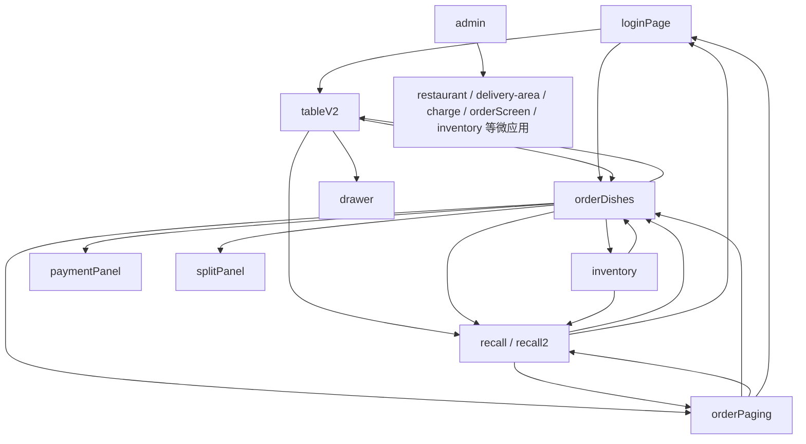

# POS前端自动化测试地图

## 1. 文档目的

本文档基于 `D:\menusifu\pos_front2\pos_front\newUI` 前端页面源码梳理 POS 主流程测试地图，并给出在当前 Playwright 仓库 `D:\menusifu\pos2.0` 中的落地建议。

重点覆盖：

1. 页面入口与跳转关系
2. 每个页面适合抽取的 page object 方法
3. 建议补充 `data-testid` 的位置
4. 适合写 smoke 的流程
5. 适合写 e2e 的流程
6. 容易因前端改动而脆弱的现有测试

## 2. 分析范围

- 前端源码主入口：`newUI/myhome.html`
- 壳层运行时：
  - `newUI/js/app/runtime/routes.js`
  - `newUI/js/app/runtime/registry.js`
  - `newUI/js/app/runtime/legacyBridge.js`
  - `newUI/js/app/runtime/recall2.js`
- wujie/qiankun 装配层：
  - `newUI/js/app/wujieManager.js`
  - `newUI/js/app/wujieMount.js`
- 关键业务事件层：
  - `newUI/js/app/event/loginEvent/*`
  - `newUI/js/app/event/orderDishes/*`
  - `newUI/js/app/event/recall.js`
  - `newUI/js/app/event/inventory.js`
  - `newUI/js/app/event/splitPanel.js`
- 关键业务逻辑：
  - `newUI/js/action.js`
  - `newUI/js/orders.js`
  - `newUI/js/functionSetup.js`

说明：

- 本文档聚焦 `newUI`，不分析 `pricing_engine`
- 本文档以“自动化测试建模”为目标，不展开业务实现细节

## 3. 页面入口与跳转关系

### 3.1 壳层页面清单

`myhome.html` 中可见的主要 page id：

- `loginPage`
- `chooseTable`
- `tableV2`
- `orderDishes`
- `recall`
- `orderPaging`
- `inventory`
- `reportpage`
- `OrderReportpage`
- `appsetting`
- `reservation`
- `dailyclose`
- `thirdApp`
- `checkinpage`
- `cashinpage`
- `TimeRecordPage`
- `deliver`
- `admin`
- `sessionpage`
- `reservationpage`

其中与主交易自动化直接相关的核心页面是：

- `loginPage`
- `tableV2`
- `orderDishes`
- `recall`
- `orderPaging`
- `inventory`
- `admin`

另外还有几个高价值非 page 型业务宿主：

- `#newLoginContainer`
- `#tableV2Container`
- `#orderDishesContainer`
- `#recall2Container`
- `#microAppContainer`
- `paymentPanel`
- `splitPanel`

### 3.2 核心路由图

### 3.3 关键入口说明

#### `loginPage`

入口职责：

- 员工口令登录
- 切换主题
- 打开消息中心
- 打开支持二维码
- 打开设备设置
- 刷新应用
- 处理来电、外卖/自取/预约分流

主要去向：

- 默认主页
- `tableV2`
- `orderDishes`

#### `tableV2`

入口职责：

- 选区域
- 选桌
- 新开单
- 从桌台页跳 Recall
- 进入换桌模式

主要去向：

- `orderDishes`
- `recall`
- 首页返回

#### `orderDishes`

入口职责：

- 点餐、加菜、改配料、改人数
- 切换订单类型
- 换桌、换服务员、改顾客
- 分单
- 支付
- 送厨、快送、存单、整单操作

主要去向：

- `tableV2`
- `recall`
- `orderPaging`
- `inventory`
- `paymentPanel`
- `splitPanel`

#### `recall / recall2`

入口职责：

- 查单
- 打开订单
- 返回主页
- 回到 `orderDishes`
- 去 `orderPaging`

说明：

- 壳页是 `#recall`
- POS2 模式下实际内容由 `recall2` 容器接管

#### `orderPaging`

入口职责：

- 刷新取餐屏
- 去点餐
- 去 Recall
- 返回首页

#### `inventory`

入口职责：

- 单项库存调整
- 批量库存调整
- 语言切换
- 返回来源页

#### `admin`

入口职责：

- 作为 qiankun 微应用宿主页
- 打开 `restaurant` / `delivery-area` / `charge` / `orderScreen` / `inventory` 等后台子应用

## 4. 每个页面适合抽哪些 Page Object 方法

以下建议遵循当前仓库的 page / flow 分层约束。

### 4.1 `employee-login.page.ts`

建议具备：

- `waitForReady()`
- `fillPasscode(passcode)`
- `submitLogin()`
- `loginWithPasscode(passcode)`
- `switchTheme(theme)`
- `openMessageCenter()`
- `openSupportDialog()`
- `openDeviceSettings()`
- `refreshApp()`
- `logout()`

### 4.2 `home.page.ts`

建议聚焦“默认首页壳层判断与导航信号”，例如：

- `waitForDefaultHomeReady()`
- `isTableV2Visible()`
- `isOrderDishesVisible()`
- `isRecallVisible()`

### 4.3 `select-table.page.ts`

建议具备：

- `waitForReady()`
- `selectArea(areaId)`
- `selectTable(tableId)`
- `selectFirstAvailableTable()`
- `startNewOrderFromTable()`
- `enterChangeTableMode()`
- `backToHome()`
- `openRecallFromHeader()`

### 4.4 `order-dishes.page.ts`

建议具备：

- `waitForReady()`
- `selectMenuGroup(groupId)`
- `selectCategory(categoryId)`
- `clickDish(dishId)`
- `selectOrderItem(orderItemId)`
- `addMainOption(optionId)`
- `addSubOption(optionId)`
- `removeCurrentOption()`
- `changeGuestCount(count)`
- `changeOrderType(orderType)`
- `changeServer(serverId)`
- `changeDriver(driverId)`
- `changeTable()`
- `openRecall()`
- `openPaging()`
- `openInventory()`
- `saveOrder()`
- `sendToKitchen()`
- `fastSend()`
- `payOrder()`
- `splitOrder()`
- `exitToHome()`
- `readOrderSummary()`
- `readSelectedOrderType()`
- `readCurrentGuestCount()`

### 4.5 `recall.page.ts`

建议具备：

- `waitForReady()`
- `searchByKeyword(keyword)`
- `selectFirstVisibleOrder()`
- `openOrderById(orderId)`
- `goToOrderDishes()`
- `goToPaging()`
- `backToHome()`
- `readFirstOrderCard()`

### 4.6 `payment.page.ts`

建议具备：

- `waitForOpen()`
- `readTotals()`
- `switchPriceType(priceType)`
- `selectPaymentMethod(method)`
- `fillPaymentAmount(amount)`
- `submitPayment()`
- `waitForPaymentSuccess()`
- `waitForPaymentError()`
- `close()`
- `readStatusBarState()`

### 4.7 `split-order.page.ts`

建议具备：

- `waitForOpen()`
- `moveDishToSuborder(dishId, suborderId)`
- `combineOrSeparate()`
- `unsplit()`
- `save()`
- `cancel()`
- `saveAndPay()`
- `saveAndPrint()`
- `readSuborderSummary()`

### 4.8 `inventory.page.ts`

建议具备：

- `waitForReady()`
- `openSingleStockDialog(itemId)`
- `openBatchStockDialog(itemIds)`
- `goBack()`
- `switchLanguage()`

## 5. 与当前 `pages/` / `flows/` 的映射建议

当前仓库已经具备较完整的对象分层：

- `pages/order-dishes.page.ts`
- `pages/payment.page.ts`
- `pages/split-order.page.ts`
- `pages/recall.page.ts`
- `pages/select-table.page.ts`
- `pages/inventory.page.ts`
- `flows/order-dishes.flow.ts`
- `flows/payment.flow.ts`
- `flows/split-order.flow.ts`
- `flows/recall.flow.ts`
- `flows/select-table.flow.ts`
- `flows/inventory.flow.ts`

建议按以下原则补强，而不是重复新建对象：

- 页面级动作继续放 `pages/`
- 业务选择策略继续放 `flows/`
- `paymentPanel` 与 `splitPanel` 继续作为独立页面对象维护
- `recall2` 不额外拆新 page，优先在 `recall.page.ts` 中封装 POS2 与 legacy 共用的稳定契约
- `admin` 微应用如果后续测试量增加，再单独补 `admin.page.ts` 能力

## 6. 哪些地方应该补 `data-testid`

当前源码中几乎没有系统性的 `data-testid`。为了降低 Playwright 定位脆弱性，建议优先补以下区域。

### 6.1 根页面与容器

- `login-page`
- `tablev2-page`
- `order-dishes-page`
- `recall-page`
- `order-paging-page`
- `inventory-page`
- `admin-page`
- `payment-panel`
- `split-panel`

### 6.2 顶部导航与页头动作

- `login-submit`
- `login-theme-switch`
- `login-message-center`
- `login-support`
- `login-device-settings`
- `login-refresh`
- `paging-refresh-screen`
- `paging-to-order`
- `paging-to-recall`
- `paging-back-home`

### 6.3 桌台页

- `table-area-tab-${areaId}`
- `table-card-${tableId}`
- `table-new-order`
- `table-change-mode`

### 6.4 点餐页

- `menu-group-${groupId}`
- `menu-category-${categoryId}`
- `dish-card-${dishId}`
- `order-item-${itemId}`
- `main-option-${optionId}`
- `sub-option-${optionId}`
- `header-action-change-type`
- `header-action-change-guest-count`
- `header-action-change-server`
- `header-action-change-table`
- `header-action-recall`
- `header-action-paging`
- `header-action-inventory`
- `bottom-action-save-order`
- `bottom-action-send-to-kitchen`
- `bottom-action-fast-send`
- `bottom-action-pay-order`
- `bottom-action-split-order`

### 6.5 Recall / Paging / Inventory

- `recall-search-input`
- `recall-order-card-${orderId}`
- `recall-open-first-order`
- `recall-go-order-dishes`
- `recall-go-paging`
- `inventory-item-${itemId}`
- `inventory-single-stock`
- `inventory-batch-stock`
- `inventory-back`

### 6.6 Payment / Split 浮层

- `payment-total`
- `payment-paid-amount`
- `payment-current-amount`
- `payment-method-${method}`
- `payment-submit`
- `payment-close`
- `payment-status-bar`
- `split-suborder-${suborderId}`
- `split-save`
- `split-cancel`
- `split-unsplit`
- `split-combine-or-separate`
- `split-save-and-pay`

## 7. 哪些流程适合写 Smoke

Smoke 目标是验证系统“可进入、可导航、关键能力可打开”，不追求全业务覆盖。

建议优先落地：

1. 员工口令登录成功并进入默认主页
2. 堂食开单：`login -> tableV2 -> orderDishes`
3. 外卖/自取开单：`login -> customer -> orderDishes`
4. `orderDishes` 页面可正常加一个菜并存单
5. `orderDishes` 可打开 `paymentPanel` 并关闭
6. `orderDishes` 可打开 `splitPanel` 并关闭
7. `orderDishes -> recall` 页面可打开
8. `orderDishes -> inventory -> back` 能回来源页
9. `orderPaging` 可进入并返回
10. `admin` 微应用宿主页可打开一个子应用并关闭

## 8. 哪些流程适合写 E2E

E2E 应表达完整业务意图，不写成机械点击脚本。

建议优先覆盖：

1. 堂食完整交易链
   - 登录
   - 选桌
   - 点菜
   - 改人数
   - 分单
   - 支付
   - Recall 校验

2. 外卖/自取完整交易链
   - 登录
   - 建客
   - 自动距离/附加费
   - 点菜
   - 存单
   - 支付

3. 换桌链
   - `orderDishes -> tableV2(changeTable) -> orderDishes`

4. POS2 Recall 链
   - 打开 `recall2`
   - 打开一张订单
   - 返回 `orderDishes`
   - 再返回主页

5. 新支付面板链
   - 打开支付
   - 切价格类型
   - 提交支付
   - 验证成功/失败态
   - 校验订单刷新

6. 库存链
   - 从点餐页进入库存
   - 调整库存
   - 返回来源页
   - 验证上下文未丢

7. 叫号链
   - `orderPaging`
   - 刷新屏幕
   - 跳 `orderDishes`
   - 跳 Recall

## 9. 现有前端测试中哪些最脆弱

### 9.1 脆弱测试类型

`newUI/test` 中存在大量源码文本匹配测试：

- 读取源码文件
- 用 `assert.match`
- 用 `source.includes`
- 用 `indexOf` 检查函数顺序

这类测试的问题是：

- 不验证真实页面行为
- 改函数名就会挂
- 调整代码顺序就会挂
- 提取公共函数就会挂
- 格式化或重构也会挂

### 9.2 典型高风险样例

- `inventoryReturnPage.source.test.js`
- `splitPanel.closeOrderSummary.source.test.js`
- `paymentPanel.statusBarSync.source.test.js`
- `crmIntegration.tab-switch-local-render.test.js`
- `languageInit.order.test.js`
- `languageDefaultLan.order.test.js`

### 9.3 粗略数量判断

按当前源码扫描，`newUI/test` 下：

- 带 `.source.test` / `Source.test` 特征的文件约 `31` 个
- 带 `readFileSync + match/includes/indexOf` 的实现耦合型测试约 `59` 个

这些都应视为“前端改动高脆弱区”。

### 9.4 相对更稳的测试

以下类型相对稳：

- 小型 VM 行为测试
- 纯函数测试
- 事件桥接行为测试

例如：

- `legacyBridge.admin-activation.test.js`
- `header.changeGuestCount.test.cjs`

后续方向应当是：

- 逐步减少源码字符串断言
- 增加真实页面契约测试
- 增加基于 page object 的 smoke / e2e

## 10. 对 `pos2.0` 仓库的直接建议

### 10.1 先补选择器契约

在目标前端补 `data-testid` 之前，当前 Playwright 仓库应避免继续扩散脆弱定位方式。

建议优先：

1. 为现有 `pages/order-dishes.page.ts`
2. `pages/payment.page.ts`
3. `pages/split-order.page.ts`
4. `pages/recall.page.ts`
5. `pages/select-table.page.ts`

建立“真实 DOM 契约清单”，统一记录：

- 已有稳定 test id
- 暂缺 test id
- 目前使用的退化定位方式
- 是否需要前端补点

### 10.2 测试层级建议

建议分三层：

1. 页面契约测试
   - 锁定关键页面 ready 信号、主要按钮、关键数值区

2. smoke
   - 验证页面可进入与关键流程可打通

3. e2e
   - 验证完整业务链

### 10.3 首批最值得落地的用例

建议首批优先完成：

1. 登录进入默认主页
2. 堂食无桌直入点餐页或选桌进点餐页
3. 点一个菜并存单
4. 打开支付面板并读取金额
5. Recall 打开第一张订单
6. 进入库存并返回
7. 分单面板打开与保存

## 11. 后续执行建议

如果要把本文档继续落成实际自动化工作，推荐顺序：

1. 先补一轮 `data-testid` 需求单
2. 再修正 `pages/` 中最脆弱的定位方式
3. 先建 smoke 套件
4. 再补完整 e2e 流程
5. 最后再考虑替换或下沉老的源码字符串断言测试

## 12. 结论

这套 POS 前端不是单纯 SPA，而是：

- jQuery Mobile page
- legacy hash 路由
- qiankun 子应用
- wujie 子应用
- 浮层业务面板

混合组成的交易前端。

因此自动化设计不能只按“一个页面一个 URL”建模，而应采用：

- page 负责页面结构与局部动作
- flow 负责业务意图与跨页编排
- payment / split / recall2 视作独立高价值业务对象
- `data-testid` 先行

只有按这套方式推进，当前 `D:\menusifu\pos2.0` 仓库的 Playwright 自动化才会稳定、可维护、可持续扩展。
