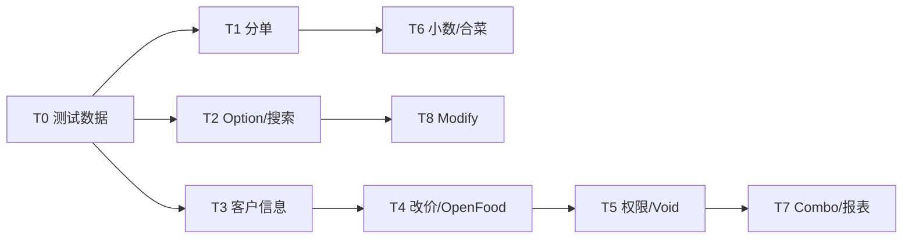

# 点单页 Python 用例迁移对照与任务计划

本文档记录 `pos-regression-test` 中 `test_order_page.py` 与本仓库 `tests/py-migrate/order.service.spec.ts` 的对照结果，以及未迁移用例所需的 Page / Flow 能力与分波次实施计划。

**对照源文件**

| 角色 | 路径 |
|------|------|
| Python 源 | `pos-regression-test/ui_autotest/case_pos/UI/pos_new_ui_case/stage0/test_order_page.py` |
| TypeScript 迁移目标 | `tests/py-migrate/order.service.spec.ts` |
| 测试数据 | `test-data/order-service.ts` |

**统计口径（2026-05-20）**

| 维度 | Python 源 | `order.service.spec.ts` |
|------|-----------|-------------------------|
| 用例总数 | 67（含 1 条 `@pytest.mark.skip`） | 16（含 2 条 Python 源文件无对应项的支付回归） |
| 已覆盖核心业务场景 | ~12 组 | 同上 |
| 未在 py-migrate 落地 | **约 55 条** | — |

说明：`tests/e2e/` 中部分契约测试（如 `order-dishes-modifier.spec.ts`）与 Python 场景相近，但**不在**本迁移 spec 范围内；下文以「py-migrate 业务 E2E 是否落地」为准。

---

## 一、已迁移（或等价覆盖）

| Python 方法 | Jira | TS 用例标题 / 说明 |
|-------------|------|-------------------|
| `test_order_switch_group` | POS-15602 | 应能 To Go 点普通菜后在 Recall 校验菜品名称和价格 |
| `test_order_switch_category` | POS-15641 | 应能 To Go 点另一个分类菜品后在 Recall 校验 |
| `test_order_edit_item_tax` | POS-30543 | 应能堂食保存后在 Recall 编辑菜品数量并校验税额实时更新 |
| `test_item_count` | POS-32905 | 应能点单时累计整数菜品数量并在 Recall 保持数量 |
| `test_delivery_order` | POS-30575 | 应能创建 Delivery 订单并在 Recall 详情展示客户信息 |
| `test_order_with_name` | POS-31409 | 应能创建带姓名的 Pick Up 订单并在 Recall 详情展示客户姓名 |
| `test_even_split_two` | POS-16303 | 应能在点单页将订单平分为两份并校验子单金额 |
| `test_order_big_tip` | POS-33110 | 应能在点单页添加超过餐费 50% 的小费并完成确认 |
| `test_order_after_big_tip` | POS-33122 | 应能在信用卡支付后追加超过餐费 50% 的小费并完成确认 |
| `test_order_category_option` 等 | POS-15643 / 15758 / 15759 | option 选择回显（合并为 1～2 条；断言方式与 Python 不完全一致） |
| — | — | **新增**：Recall 现金/信用卡支付后状态为 Success（Python 本文件无） |

### 部分迁移说明

| Jira | Python 行为 | 当前 TS 行为 | 对齐缺口 |
|------|-------------|--------------|----------|
| POS-30575 | 点单页点 Info，校验表单字段 | 保存后在 Recall 读 `customerInfo` | 需补 `OrderDishesPage` 的 Info 弹窗读写若要对齐原断言 |
| POS-15643 / 15759 | 分别测「仅一级 option」「无二级 option」 | 主要覆盖「一级 + 二级」回显 | 缺「仅一级 option」独立用例（实现成本低，可复用 `assertCategoryOptionOrderRoundTrip`） |

---

## 二、未迁移用例清单（按域分组）

### 2.1 菜单 / 语言 / 搜索（9）

| Python 方法 | Jira |
|-------------|------|
| `test_order_group_chinese` | POS-15605 |
| `test_order_category_chinese` | POS-15737 |
| `test_switch_menu_search` | POS-30762 |
| `test_search_menu_off` | POS-33447 / POS-33456 |
| `test_display_menu_name_after_modify_language` | POS-43827 |
| `test_item_with_number` | POS-36255 |
| `test_order_page_show_name` | POS-42097 |
| `test_category_required` | POS-42060 |
| `test_category_not_required_percent_charge` | POS-42958 |

### 2.2 菜品 option（菜级，非类级）（4）

| Python 方法 | Jira |
|-------------|------|
| `test_order_item_no_sub_option` | POS-15760 |
| `test_order_item_option` | POS-15761 |
| `test_order_item_no_option` | POS-15762 |
| `test_order_item_sub_option` | POS-15763 |

### 2.3 改价 / 折扣 / 备注 / Open Food（6）

| Python 方法 | Jira |
|-------------|------|
| `test_edit_price_support_discount` | POS-42886 |
| `test_add_note_by_modify` | POS-42888 |
| `test_special_price_discount` | POS-28674 |
| `test_open_food_no_tax` | POS-42011 |
| `test_open_food_keyboard_multi_language` | — |
| `test_reduce_combo_options` | POS-31045 |

### 2.4 客户信息 / Pick Up / Delivery 行为（3）

| Python 方法 | Jira |
|-------------|------|
| `test_order_edit_customer_info` | POS-42889 |
| `test_pick_up_order_no_repeat_name` | POS-42943 |
| `test_delivery_order_exit` | POS-36286 |

### 2.5 分单 / 合单 / 小费分单（11）

| Python 方法 | Jira |
|-------------|------|
| `test_add_split_by_item` | POS-16314 |
| `test_add_split_by_seat` | POS-16315 |
| `test_add_split_by_amount` | POS-16316 |
| `test_cancel_split` | POS-16318 |
| `test_even_item` | POS-16325 |
| `test_order_split_by_drag` | POS-16324 |
| `test_split_tip_combine_check` | POS-39762 |
| `test_split_by_item_subitem_discount` | POS-36254 |
| `test_item_count_decimal_split_by_drag` | POS-33241 |
| `test_item_count_decimal_combine` | POS-33244 |
| Recall 合单 `combine_order` | — |

### 2.6 数量小数 / 合并相同菜 / 减菜导航（11）

| Python 方法 | Jira |
|-------------|------|
| `test_item_count_decimal_reduce` | POS-33186 |
| `test_item_count_decimal_special_price1/2/3` | POS-33600 |
| `test_item_count_decimal_close` | POS-35129 |
| `test_item_count_decimal_combine_item_add_option` | POS-35660 |
| `test_combine_same_item_dont_automatically_combine` | POS-34895 |
| `test_combine_same_item_automatically_combine` | POS-34903 |
| `test_combine_same_item_combine_include_in_kitchen` | POS-34910 |
| `test_automatically_redirect_after_reduce_items_close` | POS-34842 |

### 2.7 Modify / Global Option（3）

| Python 方法 | Jira |
|-------------|------|
| `test_modify_add` | POS-31662 |
| `test_modify_count` | POS-31663 |
| `test_modify_reduce` | POS-31664 |

### 2.8 权限 / 删菜 / Void（5）

| Python 方法 | Jira |
|-------------|------|
| `test_no_permission_void_item` | POS-39750 |
| `test_staff_without_void_printed_item_void_hold` | POS-34873 |
| `test_staff_without_void_printed_item_void_delay` | POS-35325 |
| `test_staff_without_note_edit_sub_item` | POS-37804 |

### 2.9 套餐 / Combo（4）

| Python 方法 | Jira |
|-------------|------|
| `test_batch_edit_combo_mode` | POS-42061 |
| `test_combo_display_all_one_time_modify_sub_item` | POS-43956 |
| `test_combo_subitem_no_option_select_option` | POS-43823 |

### 2.10 自定义单型 / 报表 / 礼品卡（4）

| Python 方法 | Jira | 备注 |
|-------------|------|------|
| `test_custom_order` | POS-22640 | 含打印目录断言，环境依赖 |
| `test_custom_order_type` | POS-22657 | 云报表 + 等待，建议独立 spec |
| `test_add_gift_card` | POS-34106 | Python 已 `@pytest.mark.skip` |

---

## 三、能力缺口：Page 与 Flow

### 3.1 已有基础、缺测试与编排

| 能力 | 仓库现状 | 未迁移用例依赖 |
|------|----------|----------------|
| 分单平分 | `SplitOrderPage` + `SplitOrderFlow.splitOrderEvenly` | 已测 POS-16303 |
| 按金额 / 座位 / 拖拽 / 撤销 / 合并 | `SplitOrderPage` 有 `clickByAmount` / `clickBySeats` / `clickCancelSplit` / `combineSuborders`；Flow 有 `splitOrderByAmounts` / `splitOrderBySeats` / `combineSuborders` | POS-16314～16318、16324、16325、39762、33241、36254 |
| Recall 子单 | 详情弹窗支持 `targetOrderNumber`；缺子单状态 / 背景色 / 小费读数封装 | POS-16324、39762 |
| 小费 | `OrderDishesPage.addTip`、`RecallPage.addPaymentCardTip` | POS-39762（分单后小费 + 合并子单） |
| option（类级） | `selectCategoryOption` | POS-15760～15763（菜级路径可能不同） |
| Modify | `OrderDishesModifierSection` 部分 API | POS-42888、31662～31664 |
| Charge | `OrderDishesChargeSection` | POS-42958 |
| 数量 | `changeDishCount` / `increaseOrderedDishQuantityByOne` | 小数数量、合并菜等多条 |
| Takeout | `TakeoutFlow` | POS-42943、36286 |
| 支付 | `PaymentFlow` | POS-42011 |
| 送厨 | `OrderDishesPage.sendOrder()` | 权限 / 合并菜用例需 hold、delay、行级 void |

**建议补充 Flow**

- `splitOrderByDrag(suborders: number[][])` — 拖拽分单
- `splitOrderByItemsToSeparateSuborders(dishNames[])` — 按菜拆单
- `cancelSplitAndVerifyTotal()` — 撤销分单
- `paySuborderByCash(subOrderIndex)` + `readSuborderPaymentStatus()` — 子单部分支付
- `combineSubordersWithTipVerification()` — 合并子单后小费合计

**建议补充 Page（Recall / SplitOrder）**

- `RecallPage.openSubOrder(index)`、`readSubOrderStatus()`、`readOrderCardBackground()`
- `SplitOrderPage` 拖拽或「点选移动」API（对齐 Python `split_by_drag` / `item_add_split`）

### 3.2 页面层明显缺失

| 域 | 需新增 Page / Section | 对应用例 |
|----|----------------------|----------|
| Admin 设置 | `AdminPage` 几乎为空 | Separate same dishes、Confirm customer、Search menu、POS/EMENU、decimal count、combine dish、redirect、keyboard、staff 权限等 |
| Open Food | 无 `OpenFoodPage` | POS-42011、多语言键盘 |
| 客户信息弹窗 | 支付前客户信息、`setCustomerInfo`、必填校验 | POS-42889 |
| 点单页 Info | `clickInfo` / `readGuestInfo` | POS-30575（对齐 Python） |
| 改价 / 单菜折扣 | 有 `enterPrice`，缺 `editPrice(discount)`、读行价 | POS-42886、28674 |
| Modify 备注 | `addNoteInModifyView`、读 option 备注价 | POS-42888 |
| 送厨 / Hold / Delay | `sendAll`、`semi_send_hold_print`、`semi_send_delay_print` | POS-34873、35325、34903、34910 |
| Void 菜品 | Recall 有 void **订单**，缺 void **单行** + 原因 + 权限弹窗 | POS-39750、34873、35325 |
| 权限口令 | 受限员工登录、`enterPasscodeInPermissionDialog` | 多条权限用例 |
| 语言切换 | `HomePage` 有 language 按钮，缺 `switchLanguage` + 读组/类中文 | POS-15605、15737、43827 |
| 菜单搜索 | 有 `searchAndClickDish`，缺「只搜不点」/ 显隐 | POS-30762、33447、36255、43827 |
| 读组列表 | `readMenuGroups()` | POS-15605 |
| Guest 姓名编辑 | `editGuestName` | POS-42943 |
| 合单（Recall 跨单） | `combineOrders(source, target)` | POS-33244 |
| 自定义入口 | `enterCustomOrderType(n)` | POS-22640、22657 |
| 礼品卡 | 结算页礼品卡新建 | POS-34106（skip） |
| 打印 | `clickPrint`、读打印目录 | POS-22640 |
| Cloud Report | `ReportPage` 未接业务 | POS-22657 |
| 套餐子菜 | 缺 `modifyComboSubItem`、`reduceOption`、子菜改价权限 | POS-31045、42061、43956、43823、37804 |

### 3.3 建议新增 Flow（跨页编排）

| Flow | 职责 | 主要服务用例 |
|------|------|--------------|
| `admin-settings.flow` | API/UI 切换后台开关并 teardown | 30543 fixture、42889、33447、34895～34910、33186～35129、34842 |
| `employee-permission.flow` | 切换员工/口令、处理权限弹窗 | 39750、34873、35325、37804 |
| `order-customer.flow` | 支付前客户信息、Pick Up 双单改姓名 | 42889、42943 |
| `order-modify.flow` | Global option add/count/reduce、备注 | 31662～31664、42888、35660 |
| `order-kitchen.flow` | 全送厨 / hold / delay 后编辑删菜 | 34903、34910、34873、35325 |
| `open-food.flow` | Open Food 无税下单 + 现金结算 | 42011 |
| `recall-split.flow` | Recall 打开分单、子单切换、部分支付、合单 | 16314～16324、39762、36254 |
| `menu-admin.flow` | Admin 改菜 POS Name / 必选类 / 折扣限制 | 42060、42097、42958 |
| `language.flow` | 切换中英文并断言菜单文案 | 15605、15737、43827 |

---

## 四、分波次迁移任务表

### 波次 0：测试数据与基础设施（1～2 天）

| 任务 | 新建/扩展文件 | 内容 |
|------|---------------|------|
| T0-1 | `test-data/order-service.ts` | 中文组/类名、菜级 option 矩阵、openFood、combo、decimalQuantity、permissionStaff 等 |
| T0-2 | `test-data/order-service-cases.ts`（可选） | 纯输入/期望值矩阵 |
| T0-3 | `fixtures/admin-settings.fixture.ts`（可选） | Admin API 开关 setup/teardown |

### 波次 1：分单全场景（约 10 条用例）

| 任务 ID | Python / Jira | 目标 spec 标题（中文） | Page 补能力 | Flow 补能力 |
|---------|---------------|------------------------|-------------|-------------|
| T1-1 | `test_add_split_by_item` POS-16314 | 应按菜品拆成两个子单且金额一致 | `SplitOrderPage`：`moveDishes` / 按菜拆单 | `splitEachDishToOwnSuborder(dishNames[])` |
| T1-2 | `test_add_split_by_seat` POS-16315 | 堂食选桌后应按座位分单 | 复用 `SelectTableFlow` | `splitOrderBySeats`（已有） |
| T1-3 | `test_add_split_by_amount` POS-16316 | 应按自定义金额分单 | `clickByAmount` 等（已有） | `splitOrderByAmounts`（已有） |
| T1-4 | `test_cancel_split` POS-16318 | 应能撤销分单并恢复原总额 | `clickCancelSplit`（已有） | `cancelSplitAndAssertTotalMatches` |
| T1-5 | `test_even_item` POS-16325 | 应能将菜品平分到子单 | `clickEvenItems`（已有） | `splitOrderByItems`（已有） |
| T1-6 | `test_order_split_by_drag` POS-16324 | 分单后部分子单支付应显示正确状态 | Recall 子单状态/背景色 | `paySuborderByCash` + 校验 Paid/New Order |
| T1-7 | `test_split_tip_combine_check` POS-39762 | 分单小费合并后金额应正确 | `readSubOrderTip()` | `combineSuborders` + 读母单 Tips |
| T1-8 | `test_split_by_item_subitem_discount` POS-36254 | 子单打折应显示整单金额 | `readWholeOrderDiscountBaseAmount()` | 分单 → Recall 子单编辑 → Discount |
| T1-9 | `test_item_count_decimal_split_by_drag` POS-33241 | 小数数量拖拽分单应正确 | `readDishQuantity` | T1-6 + 小数 `changeOrderedDishQuantity` |

**建议新增文件**

- `flows/recall-split.flow.ts`
- `pages/recall/recall-suborder.section.ts`

**落点**：`order.service.spec.ts` 新增 `test.describe('分单回归')`，或拆分为 `order.service-split.spec.ts`。

### 波次 2：Option 与菜单展示（约 8 条）

| 任务 ID | Python / Jira | Page | Flow |
|---------|---------------|------|------|
| T2-1 | POS-15760～15763 | `selectDishOption(option, suboption?)` | `addDishWithOptions` |
| T2-2 | POS-15759 | 无新 page | `assertCategoryOptionOrderRoundTrip` 不传 suboption |
| T2-3 | POS-15605 / 15737 | `switchLanguage`、`readVisibleMenuGroups/Categories` | `language.flow.ts` |
| T2-4 | POS-30762 / 33447 | `searchMenu`、`readSearchResults`、`expectSearchMenuVisible` | `menu-search.flow.ts` |
| T2-5 | POS-43827 | 同上 | 依赖 T2-3 |
| T2-6 | POS-36255 | `readSearchResultCount()` | API 建/删菜，标记 API 依赖 |
| T2-7 | POS-42097 | Admin `updatePosName` | `menu-admin.flow.ts` |
| T2-8 | POS-42060 | `readCurrentCategoryName`、必选类 alert | Admin + 保存跳转 |

### 波次 3：客户信息 / Takeout（约 4 条）

| 任务 ID | Python / Jira | Page | Flow |
|---------|---------------|------|------|
| T3-1 | POS-42889 | `order-dishes-customer.dialog.ts` | `order-customer.flow.ts` |
| T3-2 | POS-30575 | `openGuestInfo`、`readGuestInfoForm` | Delivery 点单后断言 |
| T3-3 | POS-42943 | `editGuestName`、`readCustomerName` | 双 Pick Up 单改名流程 |
| T3-4 | POS-36286 | `exitOrderPage`（已有） | Delivery → exit → Home |

### 波次 4：改价 / 折扣 / 备注 / Open Food（约 6 条）

| 任务 ID | Python / Jira | Page | Flow |
|---------|---------------|------|------|
| T4-1 | POS-42886 | `order-dishes-price.section.ts` | `applyTenPercentDiscountOnDish` |
| T4-2 | POS-28674 | `enterPrice` + discount | 复用 T4-1 |
| T4-3 | POS-42888 | `addNote`、`readOrderedItemAdditions` | `addNoteViaModify` |
| T4-4 | POS-42011 | `pages/open-food.page.ts` | `flows/open-food.flow.ts` |
| T4-5 | Open Food 键盘 | `OpenFoodPage.switchKeyboardLanguage` | Admin 默认键盘 |
| T4-6 | POS-42958 | `readChargeLineAmount` | `applyChargeByScope` + Admin |

### 波次 5：送厨 / Void / 权限（约 5 条）

| 任务 ID | Python / Jira | Page | Flow |
|---------|---------------|------|------|
| T5-1 | POS-39750 | `order-dishes-void.section.ts` | `employee-permission.flow.ts` |
| T5-2 | POS-34873 / 35325 | `semiSendHold`、`semiSendDelay` | 同上 + `sendOrder` |
| T5-3 | POS-37804 | combo 子菜 note | permission dialog |
| T5-4 | — | `EmployeeLoginPage` + `logout` | `switchEmployee(passcode)` |
| T5-5 | — | `pages/shared/permission-dialog.ts` | 全权限用例共用 |

### 波次 6：数量小数 / 合并相同菜（约 11 条）

依赖 Admin API fixture：`set_count_can_be_decimal`、`set_combine_same_item`。

| 任务 ID | Python / Jira | Page | Flow |
|---------|---------------|------|------|
| T6-1 | POS-33186 | 小数 `changeOrderedDishQuantity` | decimal fixture |
| T6-2 | POS-33600 ×3 | `readPriceSummary().Subtotal` | 数据驱动 3 条 |
| T6-3 | POS-35129 | `readDishCountDisplay` | 关闭 decimal |
| T6-4 | POS-34895 / 34903 / 34910 | 行数、In Kitchen 徽章、颜色 | send + 再加菜 |
| T6-5 | POS-34842 | `expectCurrentCategory` | Admin 关 redirect |
| T6-6 | POS-35660 | global option + 小数 | combine fixture |

### 波次 7：Combo / 合单 / 自定义（约 8 条）

| 任务 ID | Python / Jira | Page | Flow | 依赖 |
|---------|---------------|------|------|------|
| T7-1 | POS-31045 | `reduceComboOption` | combo flow | — |
| T7-2 | POS-42061 | 子菜改价 | Menu API `EditPriceCombo` | |
| T7-3 | POS-43956 | `modifyComboSubItems` | Recall 编辑 | |
| T7-4 | POS-43823 | `expectOptionPanelVisible` | 动态 combo API | |
| T7-5 | POS-33244 | `combineOrders` | 两个 To Go 单 | |
| T7-6 | POS-22640 | 自定义入口 + 打印 | 打印目录 | 环境 |
| T7-7 | POS-22657 | `ReportPage` + Cloud | **独立 spec** | |
| T7-8 | POS-34106 | Gift card | 保持 skip | |

### 波次 8：Modify Global Option（3 条）

| 方案 | 说明 |
|------|------|
| A | 迁为 live `order.service.spec.ts`，复用 `OrderDishesModifierSection` |
| B | 保持 `tests/e2e/order-dishes-modifier.spec.ts` 契约覆盖，py-migrate 仅注解引用 |

Page 需补：`expectModifyPanelStillVisible`、`clickGlobalOptionAdd/Count/Reduce`。

---

## 五、文件蓝图

```
pages/
  admin/
    admin-settings.section.ts
    admin-menu.section.ts
  open-food.page.ts
  order-dishes/
    order-dishes-customer.dialog.ts
    order-dishes-guest-info.section.ts
    order-dishes-void.section.ts
    order-dishes-price.section.ts
    order-dishes-combo.section.ts
  recall/
    recall-suborder.section.ts
  shared/
    permission-dialog.ts

flows/
  recall-split.flow.ts
  order-customer.flow.ts
  employee-permission.flow.ts
  open-food.flow.ts
  menu-search.flow.ts
  language.flow.ts
  menu-admin.flow.ts
  order-kitchen.flow.ts

tests/py-migrate/
  order.service.spec.ts
  order.service-split.spec.ts    # 可选：分单用例过多时拆分

test-data/
  order-service.ts
  order-service-cases.ts         # 可选
```

---

## 六、执行顺序与优先级



| 优先级 | 波次 | 约用例数 | 理由 |
|--------|------|----------|------|
| P0 | T1 分单 | ~10 | Page 已有约 70%，收益最大 |
| P0 | T2-2 + T2-1 | ~5 | 与已迁用例同域 |
| P1 | T3 客户 | ~4 | 常见业务路径 |
| P1 | T4 改价/备注 | ~6 | modifier/price 有基础 |
| P2 | T5 权限 | ~5 | 需员工/Admin 前置 |
| P2 | T6 小数/合菜 | ~11 | 强依赖 Admin API |
| P3 | T7 Combo/报表 | ~8 | 新页 + API + 环境 |

**建议首批开工（改动面小）**

- T1-1（POS-16314 按菜分单）
- T2-2（POS-15759 仅一级 option）

---

## 七、与现有 e2e 的去重原则

| 场景 | 建议 |
|------|------|
| `order-dishes-modifier.spec.ts` 已覆盖 option 面板契约 | py-migrate 写 **live 端到端 + Recall**，不重复测 DOM 细节 |
| `split-order.spec.ts` 为 HTML fixture | 波次 T1 写 **真实 POS** live 测试 |
| `order-tips.spec.ts` fixture | POS-33110/33122 已在 `order.service`，保持 |

---

## 八、单条用例模板（spec）

```ts
test(
  '应按菜品拆成两个子单且金额一致',
  { annotation: [jiraIssueAnnotation('POS-16314')] },
  async ({ homePage, licenseSelectionPage, employeeLoginPage }) => {
    const readyHomePage = await test.step('进入 POS 主页并完成授权与员工口令', async () => {
      return await enterReadyHome({ employeeLoginPage, homePage, licenseSelectionPage });
    });

    await test.step('添加 To Go 菜品并执行按菜分单', async () => {
      // flow 编排；spec 只做业务断言
    });
  },
);
```

---

## 九、维护说明

- 新增迁移用例时：在本文档「二、未迁移」中划掉对应行，并写入「一、已迁移」表。
- Jira 键必须保留在 spec 的 `annotation` 中，便于全局搜索（见 `AGENTS.md`）。
- Page / Flow 边界遵循 `docs/page-object-guidelines.md`：业务策略放 `flows/`，单页动作放 `pages/`。

---

*文档生成自 2026-05-20 对照分析；源 Python 仓库路径以本机 `pos-regression-test` 为准。*
